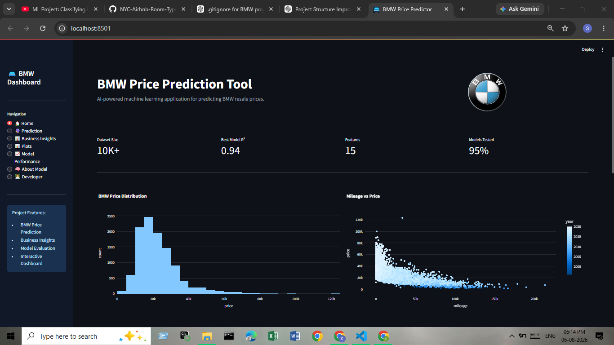
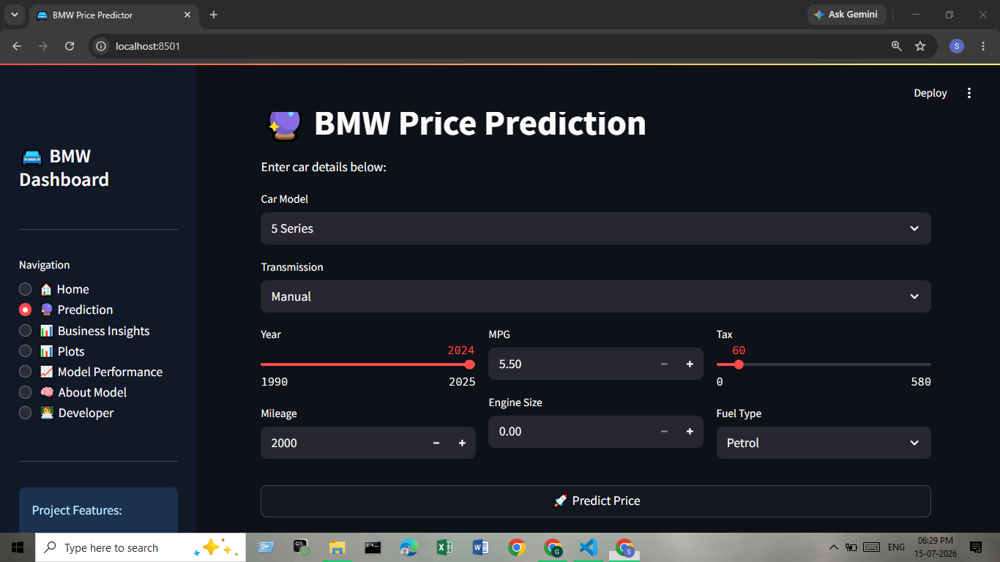
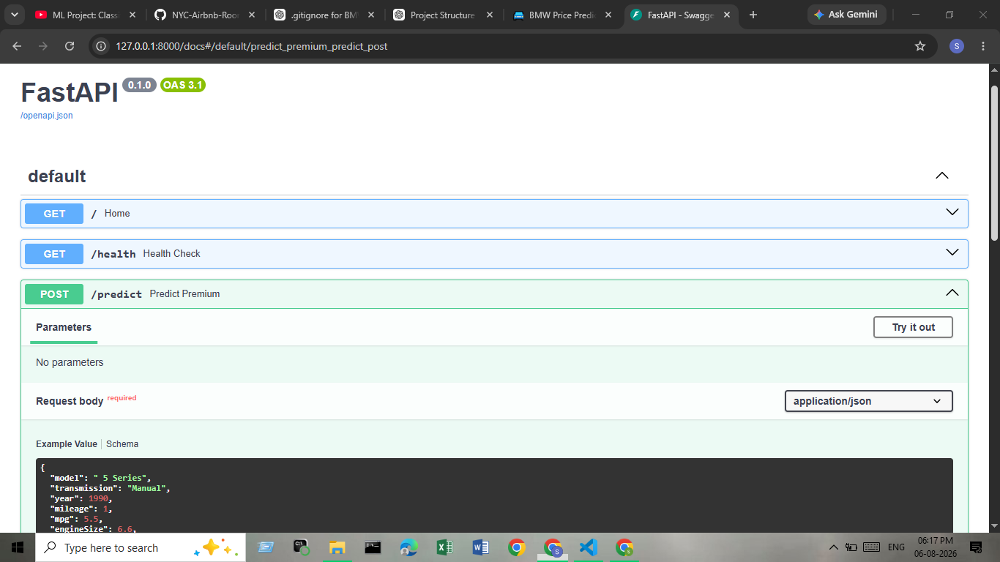

# 🚗 BMW Used Car Price Prediction

A Machine Learning web application that predicts the resale price of BMW used cars based on vehicle specifications. The project combines data preprocessing, feature engineering, model training, a FastAPI backend, and a Streamlit frontend to provide real-time price predictions.

---

## 📌 Project Overview

Buying or selling a used car at the right price can be difficult. This project uses Machine Learning to estimate the resale value of BMW cars using historical sales data.

The application allows users to enter vehicle details such as:

- Model
- Year
- Transmission
- Fuel Type
- Mileage
- Engine Size
- Tax
- MPG

and instantly predicts the expected selling price.

---

## 🛠 Tech Stack

### Programming Language
- Python

### Machine Learning
- Scikit-learn
- Pandas
- NumPy

### Data Visualization
- Plotly
- Matplotlib

### Backend
- FastAPI

### Frontend
- Streamlit

### Model Serialization
- Pickle

### Deployment
- Docker (In Progress)

---

## 📂 Project Structure

```text
BMW_PRICE_PREDICTION_MODEL/

│
├── artifacts/
│
├── backend/
│   └── app.py
│
├── frontend/
│   └── streamlit_app.py
│
├── model/
│   └── bmw_model.pkl
│
├── src/
│   ├── train.py
│   ├── predict.py
│   ├── preprocessing.py
│   ├── feature_engineering.py
│   └── models/
│
├── data/
│
├── Dockerfile
├── requirements.txt
├── README.md
└── LICENSE
```

---

## 📊 Dataset Features

| Feature | Description |
|----------|-------------|
| model | BMW Car Model |
| year | Manufacturing Year |
| transmission | Transmission Type |
| mileage | Total Kilometers Driven |
| fuelType | Fuel Type |
| tax | Road Tax |
| mpg | Fuel Efficiency |
| engineSize | Engine Size |
| price | Target Variable |

---

## ⚙️ Machine Learning Workflow

- Data Cleaning
- Feature Engineering
- Exploratory Data Analysis (EDA)
- One-Hot Encoding
- Feature Scaling
- Model Training
- Hyperparameter Tuning
- Model Evaluation
- Model Saving
- API Development
- Web Application

---

## 🤖 Models Compared

- Linear Regression
- K-Nearest Neighbors
- Decision Tree Regressor
- Random Forest Regressor

The best-performing model was selected based on evaluation metrics.

---

## 📈 Evaluation Metrics

The model was evaluated using:

- R² Score
- Mean Absolute Error (MAE)
- Mean Squared Error (MSE)
- Root Mean Squared Error (RMSE)

---

## 🚀 Running the Project

### 1. Clone Repository

```bash
git clone https://github.com/yourusername/BMW_PRICE_PREDICTION_MODEL.git

cd BMW_PRICE_PREDICTION_MODEL
```

---

### 2. Create Virtual Environment

```bash
python -m venv venv
```

Activate

Windows

```bash
venv\Scripts\activate
```

Linux / Mac

```bash
source venv/bin/activate
```

---

### 3. Install Dependencies

```bash
pip install -r requirements.txt
```

---

### 4. Start FastAPI

```bash
uvicorn backend.app:app --reload
```

API Documentation

```
http://127.0.0.1:8000/docs
```

---

### 5. Start Streamlit

```bash
streamlit run frontend/streamlit_app.py
```

---

## 📷 Application Preview

## 📷 Home Page



## 📷 Prediction



## 📷 Dashboard


## 📷 FastAPI



---

## 📌 Future Improvements

- Docker Deployment
- Cloud Deployment
- Model Monitoring
- CI/CD Pipeline
- User Authentication
- Database Integration
- Explainable AI (SHAP)

---

## 📚 Learning Outcomes

Through this project I learned:

- End-to-End Machine Learning Workflow
- Data Preprocessing
- Feature Engineering
- Regression Modeling
- Hyperparameter Tuning
- FastAPI Development
- Streamlit UI Development
- Docker Basics
- API Integration
- Model Deployment

---

## 👨‍💻 Author

Sachin Koranga

GitHub:
https://github.com/yourusername

LinkedIn:
https://linkedin.com/in/yourprofile

---

## ⭐ If you found this project helpful, consider giving it a star.